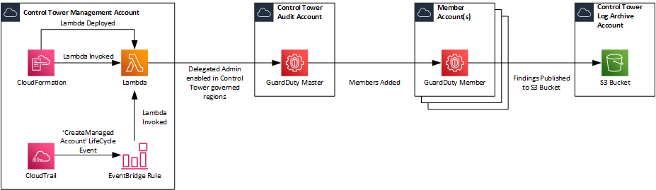

# Integrating Amazon GuardDuty with Customizations for Control Tower

The CloudFormation Template and Lambda Function have been adapted from the original source [AWS Service Catalog Reference Architectures](https://s3.amazonaws.com/aws-service-catalog-reference-architectures/security/guardduty/deploy_guardduty.yml) and the associated [blog post](https://aws.amazon.com/blogs/mt/automating-amazon-guardduty-deployment-in-aws-control-tower/).

The reason I've adapted the original template is because of the following:
1.  Once deployed, it enables GuardDuty in every AWS Region across all AWS Accounts in the Organisation. 
    * From my perspective, that could potentially add unneccesary additional costs to the overarching bill.
    * There may also be situations where Clients restrict the AWS Regions that can be used within AWS e.g. through Service Control Policies. 
    * Control Tower may not have all Regions governed by Control Tower meaning that effectively other Best Practices may not be configured within those regions. 
    * **Change Made:** The code has been tweaked to identify the Control Tower governed regions by listing the regions utilised from a deployed CloudFormation StackSet which occurs on any Control Tower deployment.  This is in light of the fact that there is no API for Control Tower.  There is also a slight change in the codes' logic to loop through all regions governed by Control Tower and if this is a supported region by GuardDuty to then proceed as per the orginal code. 
    * **Change Made:** The `get_all_accounts` python function has been updated to only return AWS Accounts in the Organisation that have a status of 'ACTIVE'. Therefore any AWS Accounts that are in a suspended state pending deletion are ignored.
2.  Once deployed the GuardDuty configuration within the Delegated Admin account is not configured for S3 Protection despite it being enabled in the GuardDuty Organisation configuration.
    * **Change Made:** The `enable_guardduty_member` python function has been updated to use the `update_detector` boto3 API to ensure this is enabled for the Delegated Admin account.
3.  If you try to delete the CloudFormation Stack that is created, it only disables the Delgated Admin of GuardDuty. All GuardDuty Member Accounts that had been configured would still be enabled in every Region.
    * There may be situations where Clients wish to use an alternative solution for Threat Detection (via a 3rd Party) as opposed to GuardDuty.
    * **Change Made:** An additional python function `disable_guardduty_member` has been created to loop through all Members and Delete the GuardDuty detector, thereby disabling GuardDuty in the region and the account. I've deliberately left the S3 Bucket used as a publishing destination for GuardDuty findings for retention of logs that may need to be kept for compliance reasons.
4. The S3 Bucket that is used as the GuardDuty Publishing Destination is configured with SSE-S3 encryption.
    * Whilst this is down to individual preference, if you're creating an KMS Key and then leveraging the bucket policy to enforce encryption of objects being put into the bucket by GuardDuty, then really the buckets default encryption should be configured to use the same KMS Key. In addition the bucket is not configured for access logging or object versioning.
    * **Change Made:** The `create_s3_destination` python function has been updated to change the Server Side Encryption Rules to leverage the KMS Key.
    * **Change Made:** The `create_s3_destination` python function has been updated to configure access logging on the GuardDuty logs bucket with the destination being set to `aws-controltower-s3-access-logs-<aws_account_id>-<region>` with a prefix of `guardduty-logs`, since they reside in the same AWS Account.
    * **Change Made:** The `create_s3_destination` python function has been updated to configure object versioning on the GuardDuty logs bucket
5.  The KMS Customer Master Key is not configured for Key Rotation.
    * [KMS - Best Practices](https://d1.awsstatic.com/whitepapers/aws-kms-best-practices.pdf) effectively says you should consider the frequency of rotation for CMKs.
    * **Change Made:** The `create_kms_key` python function has been updated to enable key rotation for the KMS CMK that is created.
6.  Added the Capabiity for both newly created AWS Accounts through the Account Vending Maching component of Control Tower or existing AWS Accounts that have been joined to the Organisation and registered in Control Tower to have GuardDuty enabled.
    * **Change Made:** Update to the CloudFormation Template to create an EventBridge Rule that is triggered based on a Control Tower LifeCycle Event `CreateManagedAccount`.
7.  Added the Capability for GuardDuty to monitor the EKS Audit Logs as part of the Organisation configuration.
    * **Change Made:** Update to `enable_guardduty_member` python function to modify the Organisation configuration accordingly.

## Architecture Overview



## Pre-Requisites and Installation

### Pre-Requisites

There is an overarching assumption that you already have [Customisation for Control Tower](https://aws.amazon.com/solutions/implementations/customizations-for-aws-control-tower/) deployed within your Control Tower Environment.

1.  Clone the GitHub Repo to your local device.
2.  Create an S3 Bucket where you'll then upload the `guardduty.zip` file to. Make a note of the bucket name and the prefix to the `guarduty.zip`. Note: The region where you create the bucket will need to be in the region of the Control Tower home region since that is where the Lambda Function will be created.

### Installation

1.  Copy the CloudFormation Template `enable-guardduty.yaml` to the `/templates` folder for use with Customisations for Control Tower.
2.  Copy the CloudFormation Parameters `enable-guardduty.json` to the `/parameters` folder for use with Customisations for Control Tower.
3.  Update the CloudFormation Parameters `enable-guardduty.json` with the required details:
    * **OrganizationId:** This is used to implement conditions within the IAM Policy used for the Lambda Execution Role. This can be obtained from with Organisations.
    * **GuardDutyMasterAccountId:** This is the AWS Account ID of the Account that you wish to configure as the delegated admin for Amazon GuardDuty.  It's recommended to use the Security Account (formerly called Audit Account) configured by Control Tower.
    * **LogArchiveAccountId:** This is the AWS Account ID of the Account that you wish to configure the S3 Bucket in for GuardDuty Findings.  It's recommended to use the Log Archive Account configured by Control Tower.
    * **S3SourceBucket:** This is the S3 Bucket where the Lambda Function source files are located.
    * **S3Key:** This is the prefix within the S3 Bucket where the Lambda Function source files are located. 
    * **RoleToAssume:** This is used within the Lambda Function to AssumeRole into other AWS Accounts in order to Create/Configure/Delete different AWS Services such as S3, KMS and GuardDuty.  This is preconfigured with a default value of `AWSControlTowerExecution` since this IAM Role is created in all AWS Accounts as part the Control Tower setup.

    ```json
    [
        {
            "ParameterKey": "OrganizationId",
            "ParameterValue": ""
        },
        {
            "ParameterKey": "GuardDutyMasterAccountId",
            "ParameterValue": ""
        },
        {
            "ParameterKey": "LogArchiveAccountId",
            "ParameterValue": ""
        },
        {
            "ParameterKey": "S3SourceBucket",
            "ParameterValue": ""
        },
        {
            "ParameterKey": "S3Key",
            "ParameterValue": ""
        },
        {
            "ParameterKey": "RoleToAssume",
            "ParameterValue": "AWSControlTowerExecution"
        }
    ]
    ```

4.  Update the `manifest.yaml` and configure the `deployment_targets` and `regions` accordingly based on your needs. The deployment target should be the AWS Control Tower Management Account since the Lambda Function that is invoked uses API Calls that are run are only available to the Master Account whilst the region should be configured to the Control Tower home region.

    ```yaml 
    - name: Enable-Amazon-GuardDuty
      description: "CloudFormation Template to Enable Amazon GuardDuty for the Organization"
      resource_file: templates/enable-guardduty.yaml
      parameter_file: parameters/enable-guardduty.json
      deploy_method: stack_set
      deployment_targets:
        accounts:
          - # Either the 12-digit Account ID or the Logical Name for the Control Tower Management Account
      regions:
        - # AWS Region that is configured as the Home Region within Control Tower
    ```